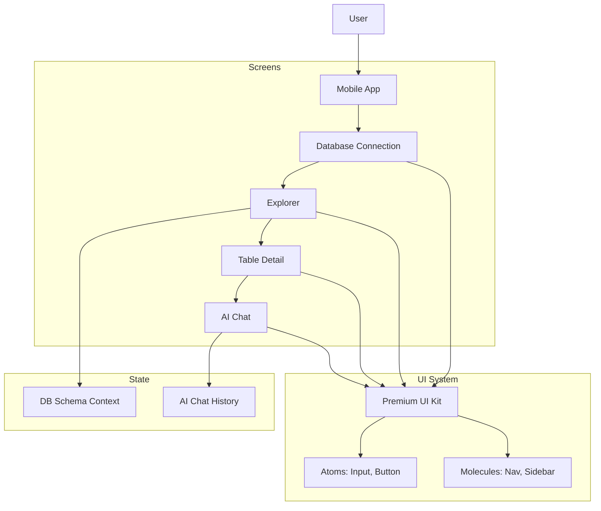

# InsightDB - AI-Powered Database Analysis

InsightDB is a premium, AI-driven database exploration and analysis tool designed with a mobile-first approach. It allows users to connect to their databases, explore schemas, analyze data quality, and interact with their data using natural language.

## 🚀 Experience the App
The application is built using **React + Vite** and styled with **Tailwind CSS**. It features:
- **Premium UI/UX**: Custom cards, glassmorphism, and smooth transitions.
- **Smart Navigation**: Context-aware bottom navigation and sidebars.
- **AI Integration**: Interactive chat interface for schema and data queries.
- **Data Insights**: Visualized data quality and schema optimization details.

## 🛠️ Tech Stack
- **Frontend**: React.js (Vite)
- **Styling**: Tailwind CSS
- **Icons**: Lucide React
- **Animations**: Framer Motion
- **Routing**: React Router DOM
- **Utilities**: clsx, tailwind-merge

## 📂 Folder Structure
```text
insightdb/
├── src/
│   ├── components/
│   │   ├── layout/       # Shared layouts (Nav, Mobile Shell)
│   │   └── ui/           # Atomic components (Buttons, Inputs)
│   ├── pages/            # Full screen components
│   │   ├── DatabaseConnection.jsx
│   │   ├── Explorer.jsx
│   │   ├── TableDetail.jsx
│   │   └── AIChat.jsx
│   ├── theme/            # Tailwind theme extensions
│   ├── App.jsx           # Routing logic
│   ├── index.css         # Global styles & Tailwind directives
│   └── main.jsx          # Entry point
├── tailwind.config.js    # Design system configuration
└── vite.config.js        # Build configuration
```

## 🏗️ Architecture & Flow

### Application Flow
1. **Connect**: User enters database credentials (`DatabaseConnection.jsx`).
2. **Explore**: User browses tables with AI insights (`Explorer.jsx`).
3. **Deep Dive**: Detailed view of specific tables, schemas, and data quality (`TableDetail.jsx`).
4. **Interact**: Natural language querying and analysis (`AIChat.jsx`).

### System Diagram


## 🎨 Design Decisions
- **Color Palette**: Sophisticated `Indigo-600` for brand actions, combined with `Slate` scales for professional readability.
- **Shadows**: Custom `premium` and `elevated` shadows were implemented to provide depth and a high-end feel.
- **Typography**: `Inter` font family for modern, crisp technical readability.
- **Layout**: Used a consistent 390px mobile-shell width for optimal demonstration.

## 🏁 Getting Started
1. Clone the repository.
2. Run `npm install`.
3. Start the dev server with `npm run dev`.
